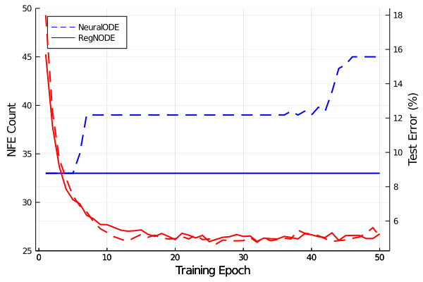

# RegNeuralODE

Regularizing Neural ODEs to make them easier to solve during evaluation

## Experiments

### Supervised MNIST Classification

### Continuous Time Series Latent ODE on PhysioNet Dataset