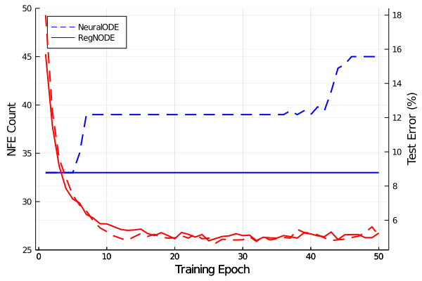
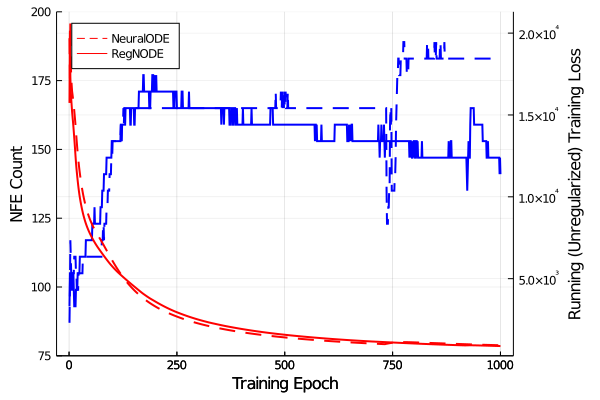

# RegNeuralODE

Regularizing Neural ODEs to make them easier to solve during evaluation

## Experiments

### Supervised MNIST Classification

### Spiral2D Latent ODE Time Series Extrapolation

## Performance Benchmarks

